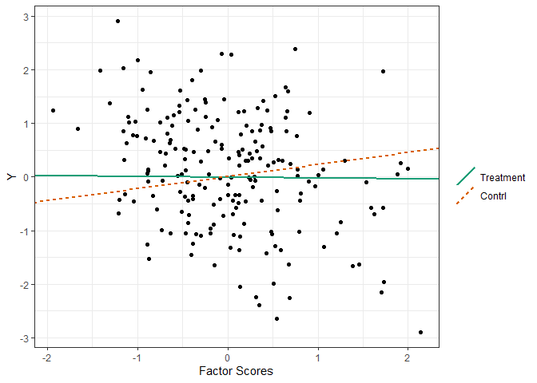

<!-- badges: start -->

[](https://CRAN.R-project.org/package=flps)
<!-- badges: end -->

## Fully Latent Principal Stratification (FLPS)

Fully Latent Principal Stratification (**FLPS**) is an extension of
principal stratification.

## Install

Install the latest release from CRAN:

``` r
devtools::install_github("sooyongl/flps")
```

The documentation is available at
[here](https://sooyongl.github.io/flps/).

If compiling errors occur, see
[here](https://github.com/stan-dev/rstan/wiki/Configuring-C---Toolchain-for-Windows#r-42).

## Basic working example

### Running with the package

- Generate a simulated rectangular data.
- This data will be converted to a list of data for
  [`rstan`](https://github.com/stan-dev/rstan) package.
- For latent variable models, Rasch, 2PL, GRM, and SEM (one-factor CFA)
  are available.

``` r
inp_data <- flps::makeInpData(
  N       = 200,  # sample size
  R2Y     = 0.2,  # r^2 of outcome
  R2eta   = 0.5,  # r^2 of eta by one covariates
  omega   = 0.2,  # the effect of eta
  tau0    = 0.23, # direct effect
  tau1    = -0.16,# interaction effect between Z and eta
  lambda  = 0.8,  # the proportion of administered items
  nitem    = 10,   # the total number of items
  nfac    = 1,    # the number of latent factors
  lvmodel = 'rasch' # tag for latent variable model; case-sensitive (use lower-case letters)
)
```

`makeInpData()` creates input data for running FLPS.

- `inp_data`: a data frame containing all the data for FLPS. It is used
  in `runFLPS` function.

``` r
# Input data matrix
data.table::data.table(inp_data)
```

    ##               Y Z          X         eta1 v1 v2 v3 v4 v5 v6 v7 v8 v9 v10
    ##   1:  1.0259233 1 -1.4644935 -1.788707138  1  0  0  0  0  0  1  0  0   0
    ##   2: -1.0841548 1  0.4281658 -0.007676593  0  0  0  1  0  1  1  0  0   1
    ##   3:  0.1089741 1 -0.8637844 -0.843340048  1  0  0  0  1  0  0  0  0   0
    ##   4:  1.0502535 1 -0.3644006 -1.388024499  0  1  0  0  1  0  0  1  0   0
    ##   5:  0.0174028 1  0.7367495  0.822777723  1  1  0  1  1  1  0  1  0   0
    ##  ---                                                                    
    ## 196:  0.3059137 0  0.1635045  0.544798530 NA NA NA NA NA NA NA NA NA  NA
    ## 197: -1.2989243 0  2.0113559  0.795131750 NA NA NA NA NA NA NA NA NA  NA
    ## 198: -1.0234759 0  1.0583534  0.809837691 NA NA NA NA NA NA NA NA NA  NA
    ## 199: -0.4449205 0 -0.5544155 -0.602114679 NA NA NA NA NA NA NA NA NA  NA
    ## 200:  0.5265454 0 -1.0333341 -2.212224653 NA NA NA NA NA NA NA NA NA  NA

- Fit your FLPS model

Now, provide information about your model. `runFLPS` internally coverts
`inp_data` into the data format for `rstan` given the information, and
runs FLPS.

To avoid having to compile the Stan code every time you run it, you can
pre-compile the code using the `modelBuilder()` function along with the
relevant measurement model. This function will compile the Stan code and
store the resulting stanmodel object in the `flps` package directory.
The next time you run `runFLPS()`, the code will skip the compilation
step, making your analysis faster and more efficient. Otherwise, it will
take a while for `runFLPS()` to compile the Stan code.

``` r
modelBuilder(type = "rasch")
```

``` r
res <- runFLPS(
  inp_data = inp_data,
  outcome = "Y",
  group = "Z",
  covariate = c("X"),
  lv_type = "rasch",
  lv_model = "F =~ v1 + v2 + v3 + v4 + v5 + v6 + v7 + v8 + v9 + v10",
  stan_options = list(iter = 1000, warmup = 500, cores = 1, chains = 2)
)
```

    ## Compiling Stan code...

    ## 
    ## SAMPLING FOR MODEL 'anon_model' NOW (CHAIN 1).
    ## Chain 1: 
    ## Chain 1: Gradient evaluation took 0.000418 seconds
    ## Chain 1: 1000 transitions using 10 leapfrog steps per transition would take 4.18 seconds.
    ## Chain 1: Adjust your expectations accordingly!
    ## Chain 1: 
    ## Chain 1: 
    ## Chain 1: Iteration:   1 / 1000 [  0%]  (Warmup)
    ## Chain 1: Iteration: 100 / 1000 [ 10%]  (Warmup)
    ## Chain 1: Iteration: 200 / 1000 [ 20%]  (Warmup)
    ## Chain 1: Iteration: 300 / 1000 [ 30%]  (Warmup)
    ## Chain 1: Iteration: 400 / 1000 [ 40%]  (Warmup)
    ## Chain 1: Iteration: 500 / 1000 [ 50%]  (Warmup)
    ## Chain 1: Iteration: 501 / 1000 [ 50%]  (Sampling)
    ## Chain 1: Iteration: 600 / 1000 [ 60%]  (Sampling)
    ## Chain 1: Iteration: 700 / 1000 [ 70%]  (Sampling)
    ## Chain 1: Iteration: 800 / 1000 [ 80%]  (Sampling)
    ## Chain 1: Iteration: 900 / 1000 [ 90%]  (Sampling)
    ## Chain 1: Iteration: 1000 / 1000 [100%]  (Sampling)
    ## Chain 1: 
    ## Chain 1:  Elapsed Time: 6.206 seconds (Warm-up)
    ## Chain 1:                4.865 seconds (Sampling)
    ## Chain 1:                11.071 seconds (Total)
    ## Chain 1:

    ## Warning: Bulk Effective Samples Size (ESS) is too low, indicating posterior means and medians may be unreliable.
    ## Running the chains for more iterations may help. See
    ## https://mc-stan.org/misc/warnings.html#bulk-ess

    ## Warning: Tail Effective Samples Size (ESS) is too low, indicating posterior variances and tail quantiles may be unreliable.
    ## Running the chains for more iterations may help. See
    ## https://mc-stan.org/misc/warnings.html#tail-ess

The summary of results can be shown by `summary()`.

``` r
summary(res, type = "casual")
```

    ##               mean     se_mean        sd       2.5%        25%        50%
    ## tau0     0.2245701 0.006182219 0.1350205 -0.0270645  0.1221805  0.2253069
    ## tau1[1] -0.2394174 0.032677400 0.2512293 -0.7502770 -0.3904672 -0.2260230
    ##                 75%     97.5%     n_eff     Rhat
    ## tau0     0.31718021 0.4954197 476.99121 1.000131
    ## tau1[1] -0.08471674 0.2532184  59.10789 1.012760

The `flps_causal()` shows the plot for the principal effects.

``` r
flps_causal(res)
```

<!-- -->
