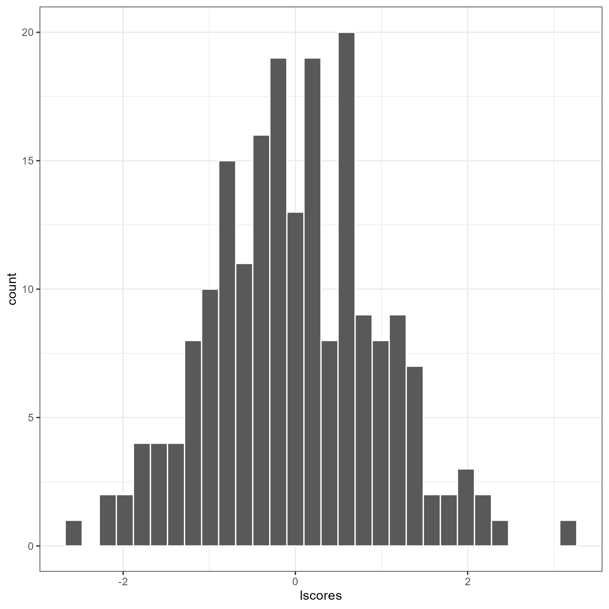

<!-- badges: start -->

[](https://CRAN.R-project.org/package=flps)
<!-- badges: end -->

## Fully Latent Principal Stratification (FLPS)[^1]

Fully Latent Principal Stratification (**FLPS**) is an extension of
principal stratification.

## Installation

Install the latest release from CRAN or git repository:

``` r
devtools::install_github("sooyongl/flps")
install.packages("flps")
```

``` r
library(flps)
```

    ## Version: 1.0.0
    ## 
    ## It is a demo.
    ## Acknowledgements. It is supported by the Institute of Education Sciences, U.S. Department of Education, through Grant R305D210036.

- Documentation is available [here](https://sooyongl.github.io/flps/).

- For compiling errors on Windows, see the relevant
  [guide](https://github.com/stan-dev/rstan/wiki/Configuring-C---Toolchain-for-Windows#r-42).

## Basic working example

### Load Example Data

- `binary`: a data frame containing all the data for FLPS. It is used in
  `runFLPS` function.
- This data will be converted to a list of data for
  [`rstan`](https://github.com/stan-dev/rstan) package.
- For latent variable models, Rasch, 2PL, GRM, SEM (one-factor CFA), and
  mixture models (LCA and LPA) are available.
- Multilevel structure will be supported soon.

``` r
data(binary)
```

``` r
# Input data frame
data.table::data.table(binary)
```

    ##       schid   id sex race pretest stdscore    cm_sex   cm_race cm_pretest
    ##    1:     1 2383   0    1      20  -0.3296 0.4406780 0.9322034   14.81356
    ##    2:     1 2384   1    0       8   1.1597 0.4406780 0.9322034   14.81356
    ##    3:     1 2385   0    1      14  -0.7385 0.4406780 0.9322034   14.81356
    ##    4:     1 2387   0    1      12  -1.3518 0.4406780 0.9322034   14.81356
    ##    5:     1 2388   0    1       6  -1.2057 0.4406780 0.9322034   14.81356
    ##   ---                                                                    
    ## 4762:    63 4761   0    1      16   0.6457 0.4860558 0.3944223   17.03187
    ## 4763:    63 4763   0    0      11   0.3168 0.4860558 0.3944223   17.03187
    ## 4764:    63 4764   0    0      18  -0.4114 0.4860558 0.3944223   17.03187
    ## 4765:    63 4765   1    0      31   2.2116 0.4860558 0.3944223   17.03187
    ## 4766:    63 4766   1    1      13  -0.0668 0.4860558 0.3944223   17.03187
    ##       cm_stdscore trt      Y q1 q2 q3 q4 q5 q6 q7 q8 q9 q10 q11 q12 q13 q14 q15
    ##    1:  -0.4068119   1 -0.487  0 NA  1  1  1  1  1 NA NA  NA  NA  NA  NA  NA  NA
    ##    2:  -0.4068119   1  0.487  1 NA  1  1  1  1  1  1  1   1   1   1  NA  NA  NA
    ##    3:  -0.4068119   1 -1.073  0 NA  1  1  0 NA NA NA NA  NA  NA  NA  NA  NA  NA
    ##    4:  -0.4068119   1 -1.087  0 NA  1  1  1 NA NA NA NA  NA  NA  NA  NA  NA  NA
    ##    5:  -0.4068119   1 -1.171  0 NA  1  1 NA NA NA NA NA  NA  NA  NA  NA  NA  NA
    ##   ---                                                                          
    ## 4762:   0.0997502   0 -0.114  0 NA NA NA NA NA NA NA NA  NA  NA  NA  NA  NA  NA
    ## 4763:   0.0997502   0 -0.438  0 NA NA NA NA NA NA NA NA  NA  NA  NA  NA  NA  NA
    ## 4764:   0.0997502   0 -1.047  0 NA NA NA NA NA NA NA NA  NA  NA  NA  NA  NA  NA
    ## 4765:   0.0997502   0  0.765  0 NA NA NA NA NA NA NA NA  NA  NA  NA  NA  NA  NA
    ## 4766:   0.0997502   0  0.539  0 NA NA NA NA NA NA NA NA  NA  NA  NA  NA  NA  NA
    ##       q16 q17 q18 q19 q20
    ##    1:  NA  NA  NA  NA  NA
    ##    2:  NA  NA  NA  NA  NA
    ##    3:  NA  NA  NA  NA  NA
    ##    4:  NA  NA  NA  NA  NA
    ##    5:  NA  NA  NA  NA  NA
    ##   ---                    
    ## 4762:  NA  NA  NA  NA  NA
    ## 4763:  NA  NA  NA  NA  NA
    ## 4764:  NA  NA  NA  NA  NA
    ## 4765:  NA  NA  NA  NA  NA
    ## 4766:  NA  NA  NA  NA  NA

### Model Fitting with FLPS

- `runFLPS()` internally transforms binary data into the format suitable
  for `rstan`, subsequently executing FLPS.

- To avoid re-compiling the Stan code each time, pre-compile it using
  `modelBuilder()`, which stores the stanmodel object in the `flps`
  directory, accelerating subsequent analyses.

- Once the Stan model is compiled, use `importModel()` to bring in the
  compiled Stan code. This code can then be provided to the
  `compiled_stan` argument in `runFLPS.` If this step is omitted,
  `runFLPS()` will compile the Stan code during each execution of FLPS.

``` r
modelBuilder(type = "rasch")
complied_stan <- importModel(type = "rasch")
```

- In case of errors, try the latest `rstan` and `StanHeaders` packages.

``` r
remove.packages(c("rstan", "StanHeaders"))
install.packages("rstan", repos = c("https://mc-stan.org/r-packages/", getOption("repos")))
```

Now, execute your FLPS model. Given the time-intensive nature of the
process, chains and iterations have been initially limited to 1 and
5000, respectively. It is advisable to increase these values for your
specific research needs.

``` r
# Subset of data: 1000 students
binary <- binary[c(sample(which(binary$trt == 1), 250), 
                   sample(which(binary$trt == 0), 250)),]

res <- runFLPS(
  inp_data = binary,
  # complied_stan = complied # if necessary
  outcome = "Y",
  trt = "trt",
  covariate = c("sex","race","pretest","stdscore"),
  lv_type = "rasch",
  lv_model = "F =~ q1 + q2 + q3 + q4 + q5 + q6 + q7 + q8 + q9 + q10",
  stan_options = list(iter = 5000, cores = 1, chains = 2)
)
```

### Results

Retrieve summaries and visualize results with the following:

``` r
summary(res, type = "causal")
```

The `flps_plot()` shows the plot related to FLPS models

``` r
flps_plot(res, type = "causal")
```


``` r
flps_plot(res, type = "latent")
```



[^1]: **Acknowledgements.** This package is supported by the Institute
    of Education Sciences, U.S. Department of Education, through Grant
    R305D210036.
