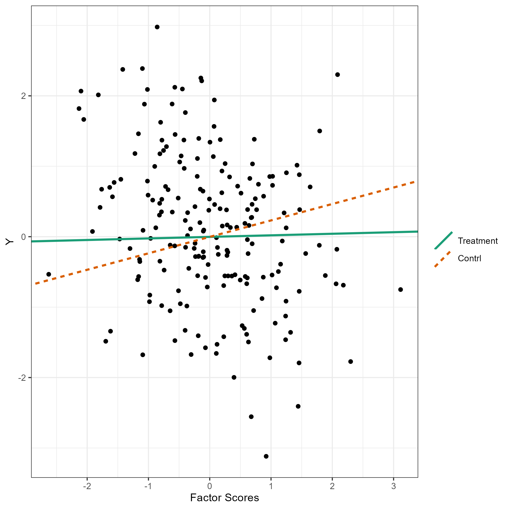
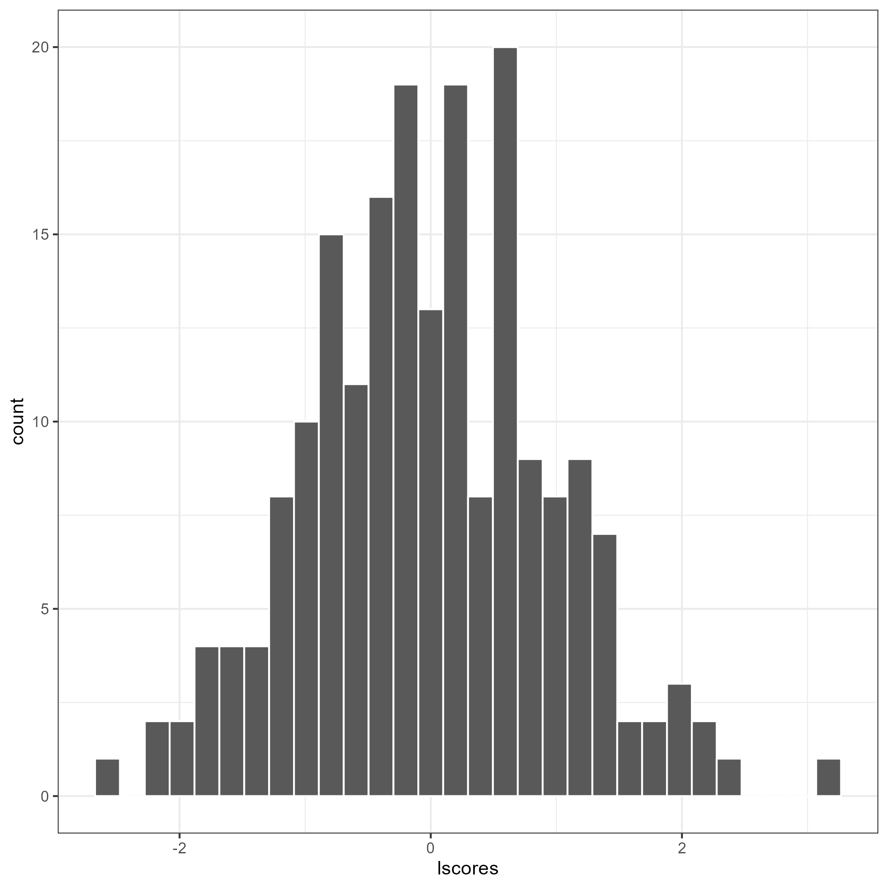

```{r, include = FALSE}
knitr::opts_chunk$set(
  eval = F,
  collapse = TRUE,
  comment = "#>",
  # fig.width = 4,
  out.width = '55%'
)
```

<!-- badges: start -->
[](https://CRAN.R-project.org/package=flps)
<!-- badges: end -->

```{r setup, eval = T}
library(flps)
```


## Fully Latent Principal Stratification (FLPS)^[**Acknowledgements.** This package is supported by the Institute of Education Sciences, U.S. Department of Education, through Grant R305D210036.]

Fully Latent Principal Stratification (**FLPS**) is an extension of principal stratification.


## Installation

Install the latest release from CRAN or git repo:

```{r eval = F}
devtools::install_github("sooyongl/flps")
```

- Documentation is available [here](https://sooyongl.github.io/flps/).

- For compiling errors on Windows, see the relevant [guide](https://github.com/stan-dev/rstan/wiki/Configuring-C---Toolchain-for-Windows#r-42).


## Example Usage

### Data Generation and Preprocessing

- Generate simulated rectangular data and convert it to a list of data suitable for the `rstan` package.

- `makeInpData()` creates input data for running FLPS.

- `inp_data`: a data frame containing all the data for FLPS. It is used in `runFLPS` function.

```{r eval = T}
set.seed(10000)
inp_data <- flps::makeInpData(
  N       = 200,  # sample size
  R2Y     = 0.2,  # r^2 of outcome
  R2eta   = 0.5,  # r^2 of eta by one covariates
  omega   = 0.2,  # the effect of eta
  tau0    = 0.23, # direct effect
  tau1    = -0.16,# interaction effect between Z and eta
  betaL   = 0.2,
  betaY   = 0.4,
  lambda  = 0.8,  # the proportion of administered items
  nitem    = 10,   # the total number of items
  nfac    = 1,    # the number of latent factors
  lvmodel = 'rasch' # tag for latent variable model; case-sensitive (use lower-case letters)
)


```


```{r eval = T}
# Input data matrix
data.table::data.table(inp_data)
```


### Model Fitting with FLPS

The `runFLPS` function internally converts `inp_data` into the appropriate data format for `rstan`, utilizing the provided information before executing the FLPS analysis.

In order to optimize your workflow, consider utilizing the `modelBuilder()` function to pre-compile the Stan code, especially if you're working with a relevant measurement model. This function compiles the `Stan` code and stores the resulting stanmodel object within the `flps` package directory. 

Note: Should you encounter an error, ensure that your `Rcpp` package is updated to the latest version. Additionally, **refreshing your R session** is recommended after executing `modelBuilder()` to avoid potential conflicts. Upon subsequent usage of `runFLPS()`, this pre-compilation ensures the function operates more swiftly and efficiently by bypassing the compilation step, providing a smoother and faster analytical process. Once the Stan model is compiled, use `importModel()` to bring in the compiled Stan code. This code can then be provided to the `compiled_stan` argument in `runFLPS.` If this step is omitted, `runFLPS()` will compile the Stan code during each execution of FLPS.

```{r eval = F}
modelBuilder(type = "rasch")
complied <- importModel(type = "rasch")
```


In case of errors, try the latest `rstan` and `StanHeaders` packages.

```{r eval = F}
remove.packages(c("rstan", "StanHeaders"))
install.packages("rstan", repos = c("https://mc-stan.org/r-packages/", getOption("repos")))
```


Now, execute your FLPS model.

```{r eval = F}
res <- runFLPS(
  inp_data = inp_data,
  # complied_stan = complied # if necessary
  outcome = "Y",
  trt = "Z",
  covariate = c("X1"),
  lv_type = "rasch",
  lv_model = "F =~ v1 + v2 + v3 + v4 + v5 + v6 + v7 + v8 + v9 + v10",
  stan_options = list(iter = 1000, warmup = 500, cores = 1, chains = 1)
)
```

### Results

Retrieve summaries and visualize results with the following:

The `flps_plot()` shows the plot related to FLPS models

```{r eval = F}

flps_plot(res, type = "causal")

```

```{r eval = T, echo=FALSE, fig.align='center', fig.cap='', out.width='60%'}
# a1 <- flps_plot(res, type = "causal")
# ggplot2::ggsave("man/figures/causal_1.png", a1)

```


```{r eval = F}

flps_plot(res, type = "latent")

```


```{r eval = T, echo=FALSE, fig.align='center', fig.cap='', out.width='60%'}
# a1 <- flps_plot(res, type = "latent")
# ggplot2::ggsave("man/figures/latent_1.png", a1)

```
